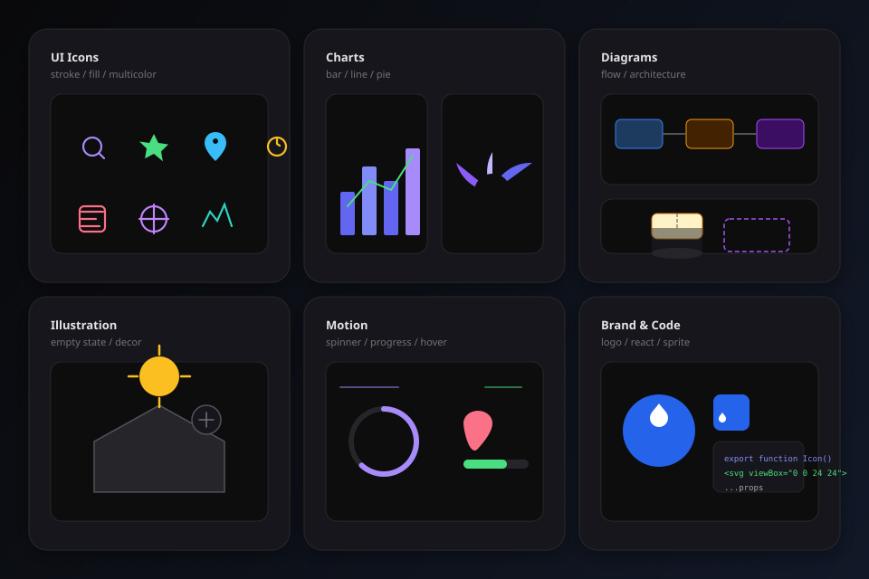

# svg-skill

<p align="center">
  <strong>Agent Skill</strong> · teaches AI coding agents to write production-ready SVG markup
</p>

<p align="center">
  
</p>

<p align="center">
  Icons · Charts · Diagrams · Motion — scalable, themeable, embeddable in code<br/>
  <sub>Not an SVG library — install as an Agent Skill pack for Cursor, Claude Code, Codex, and more</sub>
</p>

<p align="center">
  <a href="#install">Install</a> ·
  <a href="#usage">Usage</a> ·
  <a href="#showcase">Showcase</a> ·
  <a href="#中文">中文</a>
</p>

---

## Showcase

<p align="center">
  
</p>

<table align="center">
  <tr>
    <td align="center"><sub>UI Icons</sub></td>
    <td align="center"><sub>Charts</sub></td>
    <td align="center"><sub>Diagrams</sub></td>
  </tr>
  <tr>
    <td align="center"><sub>Illustration</sub></td>
    <td align="center"><sub>Motion</sub></td>
    <td align="center"><sub>Brand &amp; Code</sub></td>
  </tr>
</table>

<p align="center"><sub>All assets are SVG vectors. Try the <a href="test-output/preview.html">interactive preview</a> — animations, theme colors, copyable agent prompts.</sub></p>

---

## Install

Uses the open [Agent Skills](https://agentskills.io) format (`SKILL.md` + supporting files). Same pack works across tools.

**Clone and install**

```bash
git clone https://github.com/linyaosky/svg-skill.git
cd svg-skill
bash install.sh              # Cursor (default)
bash install.sh --all          # all supported agents
bash install.sh --claude --codex   # pick agents
bash install.sh --list         # show paths
```

**Project-scoped** (commit with your repo, share with team):

```bash
bash install.sh --project --agents    # .agents/skills/svg-skill/
bash install.sh --project --cursor    # .cursor/skills/svg-skill/
```

**Skills CLI** (70+ agents via [skills.sh](https://skills.sh)):

```bash
npx skills add linyaosky/svg-skill -g -y
npx skills add linyaosky/svg-skill -g -a claude-code -a cursor -y
```

### Supported agents

| Agent | Install flag | Global path |
|-------|--------------|-------------|
| [Cursor](https://cursor.com/docs/context/skills) | `--cursor` | `~/.cursor/skills/svg-skill/` |
| [Claude Code](https://code.claude.com/docs/en/skills) | `--claude` | `~/.claude/skills/svg-skill/` |
| [OpenAI Codex](https://developers.openai.com/codex/skills) | `--codex` | `~/.codex/skills/svg-skill/` |
| Cline, Zed, Warp, … | `--agents` | `~/.agents/skills/svg-skill/` |
| [GitHub Copilot](https://docs.github.com/copilot/customizing-copilot) | `--copilot` | `~/.copilot/skills/svg-skill/` |
| [Windsurf](https://docs.windsurf.com) | `--windsurf` | `~/.codeium/windsurf/skills/svg-skill/` |
| [Roo Code](https://docs.roocode.com/features/skills) | `--roo` | `~/.roo/skills/svg-skill/` |
| [Cline](https://docs.cline.bot/features/skills) | `--cline` | `~/.cline/skills/svg-skill/` |
| [OpenCode](https://opencode.ai/docs/skills/) | `--opencode` | `~/.config/opencode/skills/svg-skill/` |
| [Gemini CLI](https://geminicli.com/docs/cli/skills/) | `--gemini` | `~/.gemini/skills/svg-skill/` |

**Manual install** (any agent that reads `SKILL.md`):

```bash
mkdir -p ~/.cursor/skills/svg-skill   # or ~/.claude/skills/, ~/.agents/skills/, etc.
cp SKILL.md scenarios.md reference.md examples.md ~/.cursor/skills/svg-skill/
cp -r scripts ~/.cursor/skills/svg-skill/
```

---

## Usage

No extra configuration after install — chat in your agent.

### 1. Describe what you need

The agent matches the skill and outputs SVG files or code:

```
Draw a 24×24 outline search icon with currentColor
```

```
Create a user registration flowchart with arrows
```

```
Export this star icon as a React component
```

### 2. Specify a scenario

| You say | Agent does |
|---------|------------|
| "outline icon" | viewBox 24×24, stroke style |
| "bar chart, Q1–Q4 data" | scaled coords, accessible title |
| "progress ring 75%" | stroke-dashoffset math |
| "React component" | .tsx + spread props |
| "email inline" | minimal, no animation |

### 3. Invoke explicitly

```
Use svg-skill to draw a map pin icon
```

### 4. Deliverables

- Standalone `.svg` → written to your `assets/` path
- Inline `<svg>...</svg>` → paste into HTML
- React / Vue components → `.tsx` / `.vue`
- CSS snippets → `background` or `mask` referencing SVG

### 5. Validate output

```bash
bash scripts/validate.sh path/to/your-icons/
```

---

## Supported scenarios

| Category | Scenarios |
|----------|-----------|
| UI | outline/filled/multi-color icons, badges, avatar placeholders |
| Brand | logo, favicon |
| Graphics | illustration, empty state, wave divider, map pin |
| Information | flowchart, architecture diagram, bar/line/pie charts |
| Interaction | progress ring/bar, loading animation, hover effects |
| Integration | sprite, CSS mask, React/Vue, email inline |
| Effects | clip, drop shadow, pattern fill |

Full index in [SKILL.md](SKILL.md).

---

## Project structure

```
svg-skill/
├── assets/showcase/    # README visuals (hero + gallery)
├── SKILL.md            # Skill entry point
├── scenarios.md        # Per-scenario guide
├── reference.md        # Syntax & formulas
├── examples.md         # Code samples
├── scripts/validate.sh
├── install.sh
└── test-output/        # 27-scenario test suite
```

---

## Test

```bash
bash test-output/run-tests.sh      # full suite
open test-output/preview.html      # interactive preview + prompts
```

---

## Contributing

PRs welcome! See [CONTRIBUTING.md](CONTRIBUTING.md).

## License

[MIT](LICENSE)

---

## 中文

**svg-skill** 是一个 [Agent Skill](https://agentskills.io) — 不是 npm 包或 SVG 绘图库。支持 Cursor、Claude Code、Codex、Cline 等工具，安装后 Agent 会直接编写生产级 SVG 源码。

### 安装

```bash
git clone https://github.com/linyaosky/svg-skill.git
cd svg-skill
bash install.sh              # Cursor
bash install.sh --all          # 所有支持的 Agent
bash install.sh --claude       # 指定 Agent
```

也可用 Skills CLI：`npx skills add linyaosky/svg-skill -g -y`

### 使用示例

```
画一个 24×24 的描边搜索图标，用 currentColor
做一个用户注册流程图，带箭头
把星星图标导出成 React 组件
```

### 交互预览

打开 [`test-output/preview.html`](test-output/preview.html) 可体验动画、主题色切换，并一键复制 Agent 提示语。

### 测试

```bash
bash test-output/run-tests.sh
```

MIT 许可证 — 见 [LICENSE](LICENSE)。
